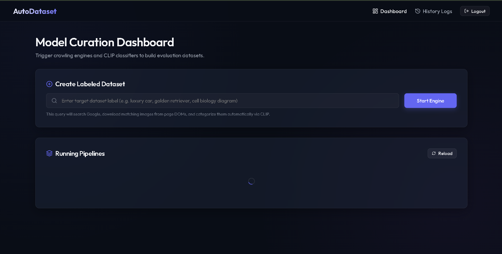
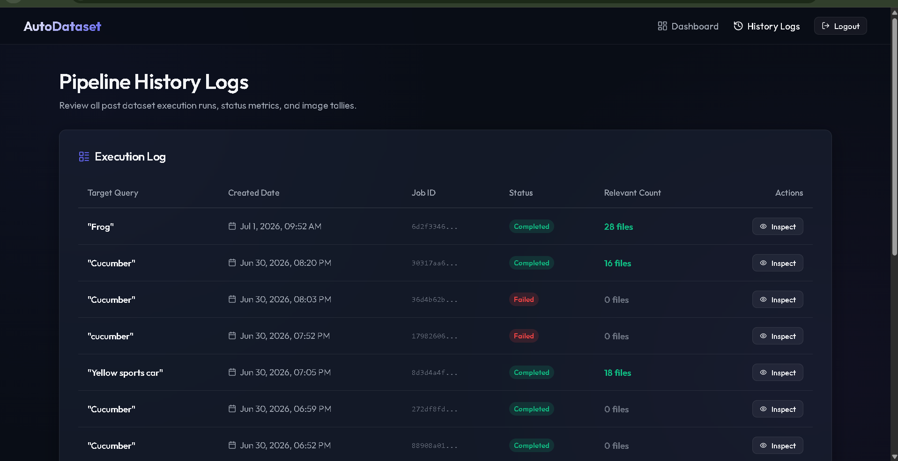
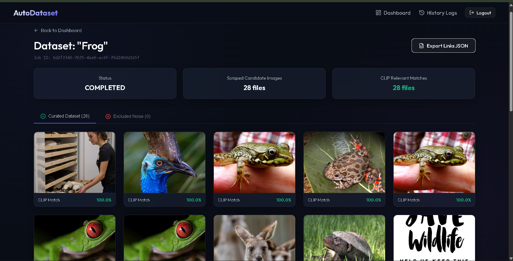
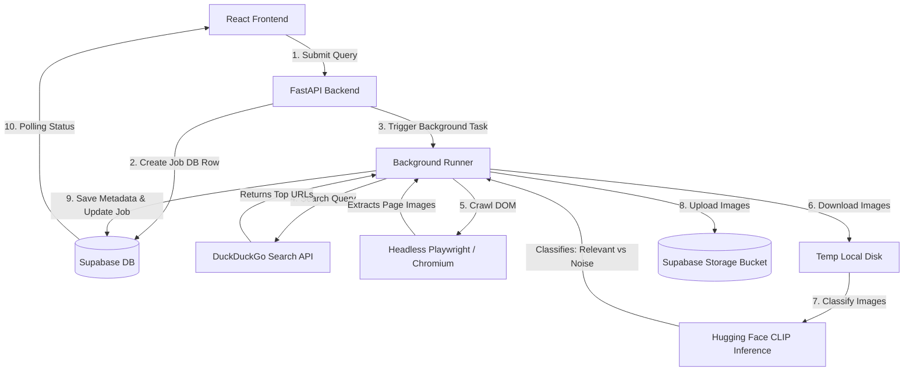

# AutoDataset 🚀 — Automated Dataset Creation & CLIP Curation Engine

AutoDataset is a modern full-stack application designed to automate the process of building clean, labeled computer vision datasets. Users simply input a query (e.g., `"Frog"`, `"luxury car"`, `"golden retriever"`), and the pipeline crawls the web, extracts images, classifies them in real-time using OpenAI's **CLIP** model, and uploads the verified dataset directly to Supabase.

The application features a sleek, responsive, and glassmorphic UI built with **React** & **Vite**, backed by a high-performance **FastAPI** worker backend.

---

## 🌐 Live Deployments

*   **Frontend Dashboard:** [https://autodataset-frontend.onrender.com](https://autodataset-frontend.onrender.com)
*   **Backend API Service:** [https://images-x5gw.onrender.com](https://images-x5gw.onrender.com)

---

## 📸 Screenshots & UI Walkthrough

### 1. Model Curation Dashboard
The control panel allows users to trigger new dataset curation pipelines. It displays active jobs with real-time progress bars.


### 2. Pipeline History Logs
A comprehensive log of all previous curation runs, displaying target labels, job execution dates, status metrics, and the tally of curated relevant images.


### 3. AI-Curated Dataset View
Inspect the results of a finished job. It splits crawled items into **Curated Dataset** (passed CLIP classification threshold) and **Excluded Noise** (filtered out by CLIP). Users can zoom in via an interactive Lightbox or export the dataset as a standardized JSON.


---

## ✨ Key Features

1.  **AI-Driven Curation (Zero-Shot CLIP Classification):** Automatically evaluates crawled images using OpenAI's `clip-vit-base-patch32` model via Hugging Face Serverless Inference. It measures the image content against the target query (e.g., `a photo of {query}` vs. `completely unrelated noise`) to filter out ads, icons, and layout graphics.
2.  **Robust Web Crawler (Headless Playwright):** Launches headless Chromium browsers to load dynamic, JavaScript-heavy web pages. It crawls page DOMs for image sources by checking `` attributes, lazy-loaded tags, `<link>` preloads, OpenGraph metadata, and inline CSS patterns.
3.  **Smart Noise Filtering:** Filters out tracking pixels, generic social sharing tags, SVGs, and files smaller than 2KB. Ignores common generic site elements like logos, avatars, and buttons.
4.  **Resilient Network Fallback:** If a network firewall blocks the Hugging Face API or it goes offline, the backend automatically transitions to a fallback mode that bypasses the CLIP model and preserves all downloaded images as relevant (with `1.0` confidence fallback).
5.  **Supabase Storage & DB Integration:** Seamlessly uploads images to Supabase Storage in isolated job-specific paths and keeps track of jobs/images using structured Postgres tables.
6.  **Interactive Lightbox & Metadata Export:** Preview curated images in full resolution and download the final image list and metadata with a single click in JSON format.

---

## ⚙️ System Architecture & Curation Flow

The flowchart below shows how the user request travels through the system:



---

## 📂 Project Structure

```text
├── Images/                     # App screenshots embedded in README
│   ├── dashboard_screenshot.png
│   ├── history_logs_screenshot.png
│   └── dataset_view_screenshot.png
│
├── backend/                    # Python FastAPI Backend
│   ├── Dockerfile
│   ├── requirements.txt        # Backend dependencies
│   ├── scratch_test.py         # DDG API test script
│   └── app/
│       ├── __init__.py
│       ├── auth.py             # User JWT auth validator for Supabase
│       ├── database.py         # Supabase client instantiation
│       ├── main.py             # FastAPI App & routing endpoints
│       └── pipeline/           # Processing pipeline logic
│           ├── __init__.py
│           ├── runner.py       # Orchestrates the background process flow
│           ├── search.py       # DuckDuckGo search querying and filtering
│           ├── downloader.py   # DOM parsing & image downloader
│           └── classifier.py   # CLIP model Inference & Supabase upload
│
└── frontend/                   # React SPA Frontend
    ├── index.html
    ├── package.json
    ├── vite.config.js
    └── src/
        ├── App.jsx             # Main routing & layout
        ├── index.css           # Styling (Glassmorphism & animations)
        ├── main.jsx            # React root mount
        ├── supabase.js         # Supabase client config
        └── pages/              # Application pages
            ├── Dashboard.jsx
            ├── DatasetView.jsx
            ├── History.jsx
            └── Login.jsx
```

---

## 🚀 Setup & Local Execution

### Prerequisites

*   **Node.js** (v18.x or later)
*   **Python** (v3.9 or later)
*   **Supabase Project** (Database + Storage bucket named `datasets`)
*   **Hugging Face Account Token** (for accessing the serverless Inference API)

### 1. Supabase Database Configuration

Run the following SQL queries in your Supabase SQL Editor to set up the necessary tables:

```sql
-- 1. Jobs Table
CREATE TABLE public.jobs (
    id UUID PRIMARY KEY DEFAULT gen_random_uuid(),
    user_id UUID NOT NULL REFERENCES auth.users(id) ON DELETE CASCADE,
    query TEXT NOT NULL,
    status TEXT NOT NULL DEFAULT 'pending',
    progress INTEGER NOT NULL DEFAULT 0,
    total_images INTEGER NOT NULL DEFAULT 0,
    created_at TIMESTAMPTZ NOT NULL DEFAULT NOW()
);

-- Enable Row Level Security (optional but recommended)
ALTER TABLE public.jobs ENABLE ROW LEVEL SECURITY;
CREATE POLICY "Users can manage their own jobs" ON public.jobs 
    FOR ALL USING (auth.uid() = user_id);

-- 2. Dataset Images Table
CREATE TABLE public.dataset_images (
    id BIGINT GENERATED BY DEFAULT AS IDENTITY PRIMARY KEY,
    job_id UUID NOT NULL REFERENCES public.jobs(id) ON DELETE CASCADE,
    image_url TEXT NOT NULL,
    is_relevant BOOLEAN NOT NULL DEFAULT TRUE,
    confidence DOUBLE PRECISION NOT NULL DEFAULT 1.0,
    created_at TIMESTAMPTZ NOT NULL DEFAULT NOW()
);

ALTER TABLE public.dataset_images ENABLE ROW LEVEL SECURITY;
CREATE POLICY "Users can view images belonging to their jobs" ON public.dataset_images
    FOR SELECT USING (
        EXISTS (
            SELECT 1 FROM public.jobs 
            WHERE jobs.id = dataset_images.job_id AND jobs.user_id = auth.uid()
        )
    );
```

> [!IMPORTANT]
> Make sure to create a **Storage Bucket** named `datasets` in your Supabase dashboard and set it to **Public** so that your React frontend can load the image URLs directly.

---

### 2. Backend Installation & Setup

1.  Navigate to the backend directory:
    ```bash
    cd backend
    ```
2.  Create and activate a virtual environment:
    ```bash
    python -m venv venv
    # On Windows:
    .\venv\Scripts\activate
    # On macOS/Linux:
    source venv/bin/activate
    ```
3.  Install dependencies:
    ```bash
    pip install -r requirements.txt
    ```
4.  Install headless browser instances for Playwright:
    ```bash
    playwright install chromium
    ```
5.  Create a `.env` file in the `backend/` folder and insert your credentials:
    ```env
    SUPABASE_URL=https://your-project-ref.supabase.co
    SUPABASE_KEY=your-supabase-service-role-or-anon-key
    HUGGINGFACE_API_TOKEN=your-hf-token
    ```
6.  Start the FastAPI local development server:
    ```bash
    uvicorn app.main:app --reload --port 8000
    ```
    The Swagger API documentation will be available at [http://127.0.0.1:8000/docs](http://127.0.0.1:8000/docs).

---

### 3. Frontend Installation & Setup

1.  Navigate to the frontend directory:
    ```bash
    cd ../frontend
    ```
2.  Install dependencies:
    ```bash
    npm install
    ```
3.  Create a `.env` file in the `frontend/` folder:
    ```env
    VITE_SUPABASE_URL=https://your-project-ref.supabase.co
    VITE_SUPABASE_ANON_KEY=your-supabase-anon-key
    VITE_API_URL=http://localhost:8000
    ```
4.  Run the Vite development server:
    ```bash
    npm run dev
    ```
    Open your browser and navigate to [http://localhost:5173](http://localhost:5173).

---

## 🛠️ Deploying to Render

### Backend Deployment

*   **Environment:** Python
*   **Build Command:** `pip install -r requirements.txt && playwright install chromium`
*   **Start Command:** `uvicorn app.main:app --host 0.0.0.0 --port $PORT`
*   **Environment Variables:** Make sure to define `SUPABASE_URL`, `SUPABASE_KEY`, and `HUGGINGFACE_API_TOKEN` under your Render service environment settings.

### Frontend Deployment

*   **Environment:** Static Site (or Node)
*   **Build Command:** `npm run build`
*   **Publish Directory:** `dist`
*   **Environment Variables:** Add `VITE_SUPABASE_URL`, `VITE_SUPABASE_ANON_KEY`, and `VITE_API_URL` (pointing to your live Render backend URL).

---

## 📜 License

This project is open-source and available under the [MIT License](LICENSE).
